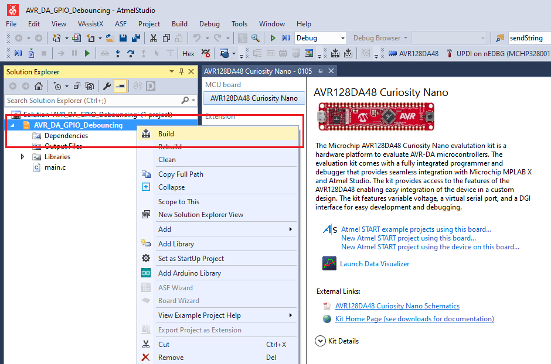
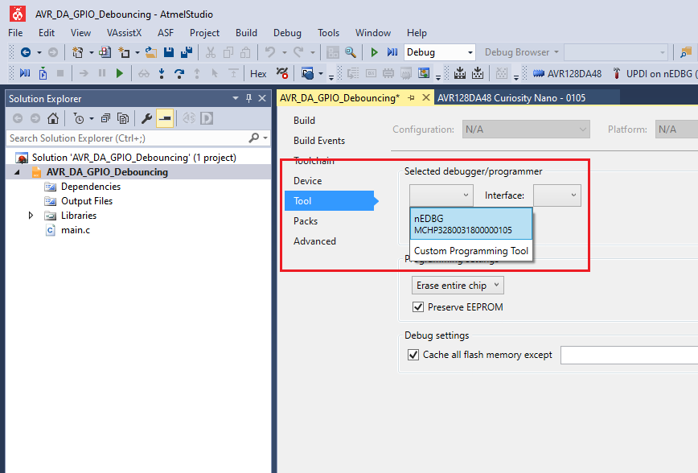
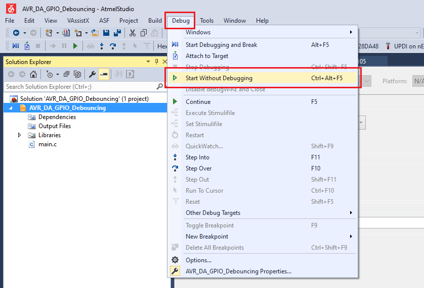

# AVR128DA48 GPIO Debouncing Code Example

This repository provides an Atmel Studio solution with a bare metal code example for a button debouncing. Using the event system, the button state change will trigger the TCB0 timer configured in single shot mode. A timer interrupt is set to be activated when the timer counter reaches the top value.

With this setup, when the button on the Curiosity Nano board is pressed, an interrupt will be triggered after ~32 milliseconds, when the button bouncing is over. In this example, the interrupt will turn on the LED0 when the button is pressed, and off when the button is released.

## Related Documentation
More details and code examples on the AVR128DA48 can be found at the following links:
- [AVR128DA48 Product Page](https://www.microchip.com/wwwproducts/en/AVR128DA28)
- [AVR128DA48 Code Examples on GitHub](https://github.com/microchip-pic-avr-examples?q=avr128da48)
- [AVR128DA48 Project Examples in START](https://start.atmel.com/#examples/AVR128DA48CuriosityNano)

## Software Used
- Atmel Studio 7.0.2397 or newer [(microchip.com/mplab/avr-support/atmel-studio-7)](https://www.microchip.com/mplab/avr-support/atmel-studio-7)
- AVR-Dx 1.0.18 or newer Device Pack

## Hardware Used
- AVR128DA48 Curiosity Nano [(DM164151)](https://www.microchip.com/Developmenttools/ProductDetails/DM164151)

## Setup
The AVR128DA48 Curiosity Nano Development Board is used as test platform
 

The following configurations must be made for this project:

- EVSYS - Using Channel 3, Port C Pin 7 triggers the TCB0
- TCB0 - Configured in Single Shot Mode

|Pin           | Configuration      |
| :----------: | :----------------: |
|PC6 (LED0)    | Digital Output     |
|PC7 (SW0)     | Digital Input      |

## Operation

1. Open the *AVR_DA_GPIO_Debouncing.atsln* solution in Atmel Studio

2. Build the solution: right click on *AVR_DA_GPIO_Debouncing* solution and select Build
 

3. Select the AVR128DA48 Curiosity Nano on-board debugger in the *Tool* section of the project settings:
 - Right click on the project and click *Properties*;
 - Click *Tool* tab on the left panel, select the corresponding debugger and save the configuration (Ctrl + S)
 

4. Program the project to the board: select *AVR_DA_GPIO_Debouncing* project and click *Start Without Debugging*:
 

Demo:
 

## Summary
This example represents a basic button debouncing implementation. Using the event system, the button state change triggers the timer configured in single shot mode. A timer interrupt is set to be activated when the timer counter reaches the top value.
